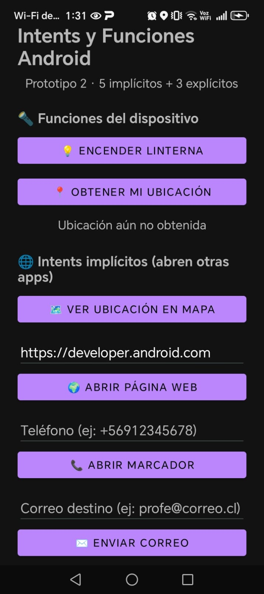
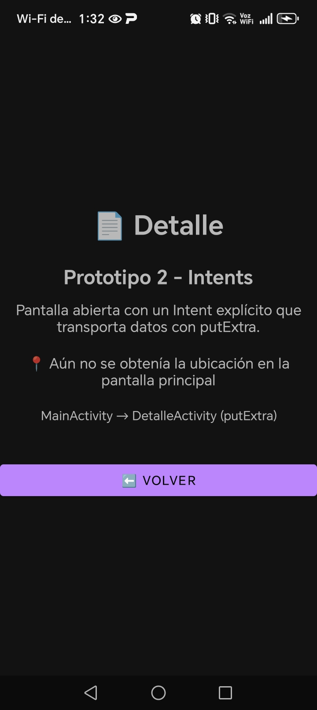
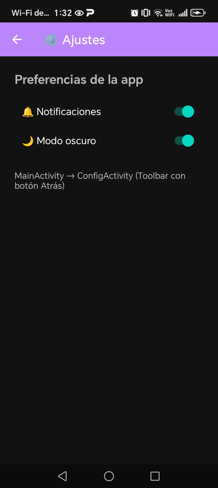
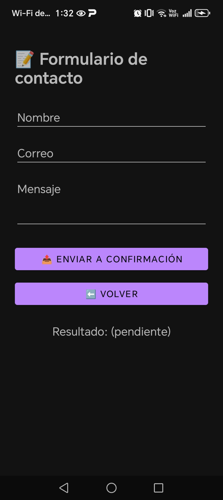

# 📱 Prototipo 2 · Intents Android

> Aplicación Android en **Java** que implementa **8 intents**: 5 implícitos 🌐 y 3 explícitos 📲, con validaciones de permisos, campos y resultados.

---

## 👥 Equipo

| Integrante | Rol |
|---|---|
| Nombre 1 | Carlos Gonzalez

---

## 🧾 Resumen del proyecto

Este es el segundo prototipo del ramo **Programación Android**. Parte del proyecto base *Semana7* (linterna 🔦, geolocalización 📍 y mapa 🗺️) y agrega:

- 🌐 **5 intents implícitos**, que abren apps del sistema u otras apps.
- 📲 **3 intents explícitos**, que navegan entre pantallas propias, con extras y con resultado.
- ✅ **Validaciones**: permisos, campos vacíos, formatos (URL, teléfono, correo), valores `null` y existencia de una app capaz de responder (`resolveActivity` + `<queries>`).

### ⚙️ Versiones

| Elemento | Versión |
|---|---|
| Lenguaje | Java 11 |
| Android Gradle Plugin (AGP) | 9.0.1 |
| compileSdk / targetSdk | 36 (Android 16) |
| minSdk | 31 (Android 12) |

---

## 🌐 Intents implícitos (5)

| # | Intent | Acción | Validaciones | Cómo probarlo |
|---|---|---|---|---|
| 1 | 🗺️ Ver ubicación en mapa | `ACTION_VIEW` + `geo:lat,lng?q=` | Exige obtener la ubicación primero; `resolveActivity` | Presiona **Obtener mi ubicación**, acepta el permiso y luego presiona **Ver ubicación en mapa** |
| 2 | 🌍 Abrir página web | `ACTION_VIEW` + `https://` | Campo vacío; agrega `https://` si falta; `Patterns.WEB_URL` | Escribe `www.inacap.cl` y presiona **Abrir página web** |
| 3 | 📞 Abrir marcador | `ACTION_DIAL` + `tel:` | Campo vacío; regex de 8–12 dígitos. No requiere `CALL_PHONE` | Escribe `+56912345678` y presiona **Abrir marcador** |
| 4 | ✉️ Enviar correo | `ACTION_SENDTO` + `mailto:` (prellena asunto y cuerpo) | Campo vacío; `Patterns.EMAIL_ADDRESS` | Escribe un correo y presiona **Enviar correo** |
| 5 | 🖼️ Elegir imagen de galería | `ACTION_GET_CONTENT` + `image/*`, con el resultado mostrado en un `ImageView` | Usuario cancela; URI `null` | Presiona **Elegir imagen de galería** y selecciona una foto |

## 📲 Intents explícitos (3)

| # | Navegación | Qué demuestra | Cómo probarlo |
|---|---|---|---|
| 1 | `MainActivity → DetalleActivity` | Envío de datos con `putExtra` (String, double, boolean) y lectura con `getXxxExtra`, con validación de `null` | Presiona **Ver detalle** |
| 2 | `MainActivity → ConfigActivity` | `Toolbar` con botón **Atrás ←** (`onSupportNavigateUp`) y ajustes guardados en `SharedPreferences` (modo oscuro 🌙) | Presiona **Ajustes**, cambia un switch y vuelve con la flecha |
| 3 | `FormActivity → ConfirmActivity` | Devuelve un resultado con `registerForActivityResult()` y `setResult(RESULT_OK / RESULT_CANCELED)` | Presiona **Formulario**, completa los campos, envía y luego elige **Confirmar** o **Corregir** |

### 🧭 Mapa de navegación

```
                    ┌──────────────────┐
                    │   MainActivity   │
                    └────────┬─────────┘
        ┌────────────────────┼─────────────────────┐
        ▼                    ▼                     ▼
┌───────────────┐   ┌────────────────┐   ┌────────────────┐
│DetalleActivity│   │ ConfigActivity │   │  FormActivity  │
│  (putExtra)   │   │ (Toolbar ←)    │   └───────┬────────┘
└───────────────┘   └────────────────┘     envía │  ▲ resultado
                                                 ▼  │ (RESULT_OK)
                                         ┌────────────────┐
                                         │ConfirmActivity │
                                         └────────────────┘
```

---

## 📸 Capturas

> Guarda las imágenes en la carpeta `capturas/` con estos nombres (mínimo 4).

| Pantalla principal         | Detalle | Ajustes | Confirmación |
|----------------------------|---|---|---|
|  |  |  |  |

---

## 🚀 Cómo compilar y ejecutar

1. 📥 Clona el repositorio:
   ```bash
   git clone https://github.com/karlo-co/semana7.1.git
   ```
2. 🧩 Ábrelo en **Android Studio** y espera a que termine *Gradle Sync*.
3. ▶️ Ejecútalo en un emulador o un teléfono con Android 12 o superior.
4. 📦 Para generar el APK debug: **Build → Build App Bundle(s) / APK(s) → Build APK(s)**.
   El archivo queda en:
   ```
   app/build/outputs/apk/debug/app-debug.apk
   ```


---

## 🌿 Ramas

- `main`: versión estable.
- `feature/intents`: rama de trabajo donde se desarrollaron los intents.

---

## 🧠 Lecciones aprendidas

- Desde **Android 11**, `resolveActivity()` devuelve `null` si no se declaran `<queries>` en el Manifest.
- `ACTION_DIAL` no necesita permisos; `ACTION_CALL` sí.
- `registerForActivityResult()` reemplaza a `startActivityForResult()`, que está obsoleto.
- Se deben validar siempre los extras, porque pueden llegar como `null`.
